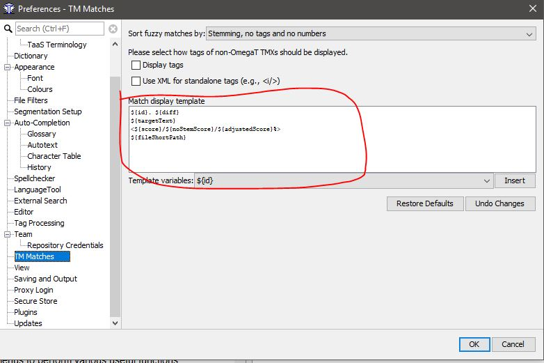

Начальные настройки
*******************

Создание проекта
================

10-минутное видео на сайте http://omegat.org/ в разделе Get Started

Шаги для начала работы с программой:

- Создать новую директорию под названием omegat (к примеру) в директории Documents
- Открыть программу OmegaT.
- Project -> New
- В окне Create a New Project найти созданную директорию omegat и кликнуть на нее два раза курсором
- В окне Create a New Project в поле Folder Name дописать \\sanctions-EN
- Нажать Save
- В появившемся окне настроек выбрать языки en-us, ru-ru
- Отметить галочкой Remove Tags
- Нажаить OK

.. figure::  images/create_new_project00.jpg
   :align:   center

   Создание проекта под названием sanctions-EN в директории omegat

.. figure::  images/create_new_project01_remove_tags.jpg
   :align:   center

   Языки и Remove Tags

.. figure::  images/create_new_project02_proj_files_win_close.jpg
   :align:   center

   Это окно можно закрыть

Настройки Editor
======

- Options -> Editor
- Галочка у Insert the best fuzzy match
- Minimal similarity: 75
- Удалить "Fuzzy" в поле Prefix
- Галочка у Allow translation to be equal to source

.. figure::  images/editor_view.jpg
   :align:   center

Cпелл-чекеры
============

Чтобы в программе работала проверка орфографии, нужно:

- Создать директорию spellcheckers (конкретное название не важно) в директории omegat (можно в любом другом удобном месте)
- Затем Options -> Preferences -> Spellcherker
- Отметить галочкой Automatically check the spelling of text
- Скоприровать url и перейти на страницу по url в интернете в вашем веб-браузере
- Скачать файл en_US.zip и сохранить его в созднанной на этапе 1 папке spellcheckers
- Скачать файл ru_RU.zip и сохранить его там же
- Распаковать zip-файлы (не создавая при этом вложенные директории внутри папки spellcheckers)
- В окне Preference - Spellcherker, нажав на кнопку Browse..., указать путь к папке с файлами спелл-чекера
- В поле Dictionaries already installed должны появиться названия словарей

См. картинки ниже

.. figure::  images/spellcheckers_en_US_zip_donwload.jpg
   :align:   center

   Скачивание файлов со словариями для орфографии

.. figure::  images/spellcheckers_ru_RU_zip_donwload.jpg
  :align:   center

.. figure::  images/spellcheckers_unzipped_files.jpg
   :align:   center

   Распакованные файлы со словарями

.. figure::  images/spellcheckers_view.jpg
   :align:   center

   Так должно выглядеть в финале

.. warning::
   Названия языков каждого из созданных проектов должны совпадать с языками в спелл-чекере.

Открыв проект, перейти Project -> Properties, и убедиться, что там точно
такие же названия языков, что и в Options -> Preferences -> Spellcheсker,
а именно en-us, ru-ru

Подробности или для лучшего понимания сайт разработчиков:
http://omegat.sourceforge.net/manual-latest/en/chapter.spellchecker.html

Сегментирование
===============

Скачать файл segmentation.conf
и разместить его в папке C:\Users\username\AppData\Roaming\OmegaT,
заменив существующий там файл.

Другие правила можно добавлять постепенно по мере работы с программой.

- Options -> Segmentation

Одно полезное правил д.
Галочка в поле break/exception для принудительной разбивки предложений.

Примеры правила сегментирования

=====================   ==============================
before	                after
=====================   ==============================
``стр\.``               \\s
``[А-Я]\.[А-Я]\.``      \\s
``г\.``                 \\s[А-я]
``д\.``                 \\s\\d
``долл\.``              \\s[США]|\\s[а-я]
``[A-Z]\.[A-Z]\.``      \\s
``U\.S\.``              \\s[a-z]|\\sGovernment|\\sLNG
``L\.L\.P\.``           \\s[a-z]
``U\.K\.``              \\s
``Stat\.``              \\s\\d
``S\.A\.``              \\s[a-z]
``E\.O\.``              \\s[0-9]|\\s[a-z]
``U\.S\.C\.``           \\s\\d
``SEC\.``               \\s\\d
``Sec\.``               \\s\\d
``sec\.``               \\s\\d
=====================   ==============================

.. figure::  images/segm_setup_00_init_view.jpg
   :align:   center

   Начальный вид

.. figure::  images/segm_setup_01_add_my_rules_move_up.jpg
   :align:   center

.. figure::  images/segm_setup_02_my_rules_at_top.jpg
   :align:   center

   Переместили наши правила на самый верх

.. figure::  images/segm_setup_02_add_rules.jpg
   :align:   center

   Пример добавленных правил

Подробное описание правил в документации разработчиков:

- http://omegat.sourceforge.net/manual-latest/en/chapter.segmentation.html
- http://omegat.sourceforge.net/manual-latest/en/chapter.regexp.html

TM Matches
===========

Options -> Editor -> TM Matches

Заменить весь текст в поле Match display template следующим текстом::

  ${id}. ${diff}
  ${targetText}
  <${score}/${noStemScore}/${adjustedScore}%>
  ${fileShortPath}

Подробности на сайте разработчиков:
http://omegat.sourceforge.net/manual-latest/en/chapter.user.interface.html#match.viewer

View
====

В меню View, отметить первые две опции по цветам - Mark Translated/Untranslated Segments

Опционально
===========

Автозаполнение
